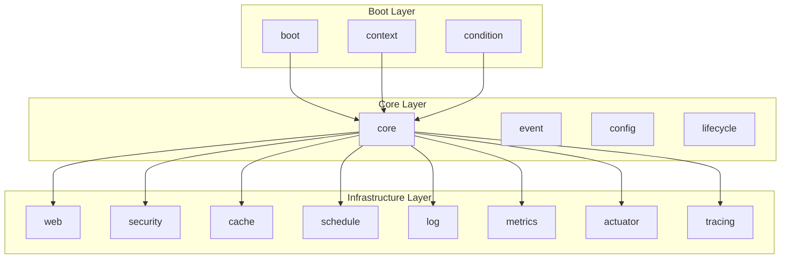

# enhance 依赖关系图

本文档提供 enhance 项目的包间依赖关系可视化。

## 1. 三层架构

enhance 采用三层架构设计，依赖方向单向：

```
Boot Layer → Core Layer → Infrastructure Layer
```

## 2. ASCII 依赖图

```
┌─────────────────────────────────────────────────────────────┐
│                    Boot Layer                               │
│  ┌─────────┐  ┌─────────┐  ┌─────────┐                    │
│  │  boot   │  │context  │  │condition│                    │
│  └────┬────┘  └────┬────┘  └────┬────┘                    │
│       │            │            │                           │
└───────┼────────────┼────────────┼───────────────────────────┘
        │            │            │
        ▼            ▼            ▼
┌─────────────────────────────────────────────────────────────┐
│                    Core Layer                               │
│  ┌─────────┐  ┌─────────┐  ┌─────────┐  ┌─────────┐     │
│  │  core   │  │  event  │  │ config  │  │lifecycle│     │
│  └────┬────┘  └────┬────┘  └────┬────┘  └────┬────┘     │
│       │            │            │            │            │
└───────┼────────────┼────────────┼────────────┼────────────┘
        │            │            │            │
        ▼            ▼            ▼            ▼
┌─────────────────────────────────────────────────────────────┐
│                Infrastructure Layer                         │
│  ┌─────────┐  ┌─────────┐  ┌─────────┐  ┌─────────┐     │
│  │   web   │  │security │  │  cache  │  │ schedule│     │
│  └─────────┘  └─────────┘  └─────────┘  └─────────┘     │
│  ┌─────────┐  ┌─────────┐  ┌─────────┐  ┌─────────┐     │
│  │   log   │  │ metrics │  │ actuator│  │ tracing │     │
│  └─────────┘  └─────────┘  └─────────┘  └─────────┘     │
└─────────────────────────────────────────────────────────────┘
```

## 3. Mermaid 依赖图



## 4. 依赖方向规则

### 4.1 单向依赖
- Boot Layer → Core Layer → Infrastructure Layer
- 禁止循环依赖
- 低优先级包不能依赖高优先级包

### 4.2 Starter 独立性
- Starter 包之间禁止互相依赖
- 每个 Starter 自带独立 go.mod
- 第三方集成必须放 starter/ 目录

### 4.3 核心包零依赖
- 核心包（core、event、config、lifecycle）只能使用 Go 标准库，不允许引入任何第三方依赖。第三方集成必须放 `starter/` 目录，每个 Starter 自带独立 go.mod（AGENTS.md §0.1）。
- 第三方集成必须放 starter/ 目录

## 5. 包间依赖详情

### 5.1 Boot Layer
- **boot**: 依赖 core, condition
- **context**: 依赖 core, boot, event, lifecycle, config
- **condition**: 依赖 core, config

### 5.2 Core Layer
- **core**: 零依赖（仅标准库）
- **event**: 依赖 core
- **config**: 依赖 core
- **lifecycle**: 依赖 core

### 5.3 Infrastructure Layer
- **web**: 依赖 core, config, log
- **security**: 依赖 core, web, config
- **cache**: 依赖 core
- **schedule**: 依赖 core, config
- **log**: 依赖 core
- **metrics**: 依赖 core
- **actuator**: 依赖 core, web, config
- **tracing**: 依赖 core

## 6. 使用方法

### 6.1 生成 ASCII 图
```bash
./scripts/deps-visualize.sh ascii
```

### 6.2 生成 Mermaid 图
```bash
./scripts/deps-visualize.sh mermaid
```

### 6.3 生成 JSON 数据
```bash
./scripts/deps-visualize.sh json
```

## 7. 验证依赖方向

### 7.1 检查循环依赖
```bash
go list -f '{{if .Imports}}{{join .Imports "\n"}}{{end}}' ./... | sort | uniq -c | sort -rn
```

### 7.2 检查依赖方向
```bash
./scripts/ai-check.sh
```

## 8. 参考资料

- [DEPENDENCIES.md](../DEPENDENCIES.md) - 详细依赖关系
- [ARCHITECTURE.md](../ARCHITECTURE.md) - 三层架构设计
- [AGENTS.md](../AGENTS.md) - 依赖方向规范